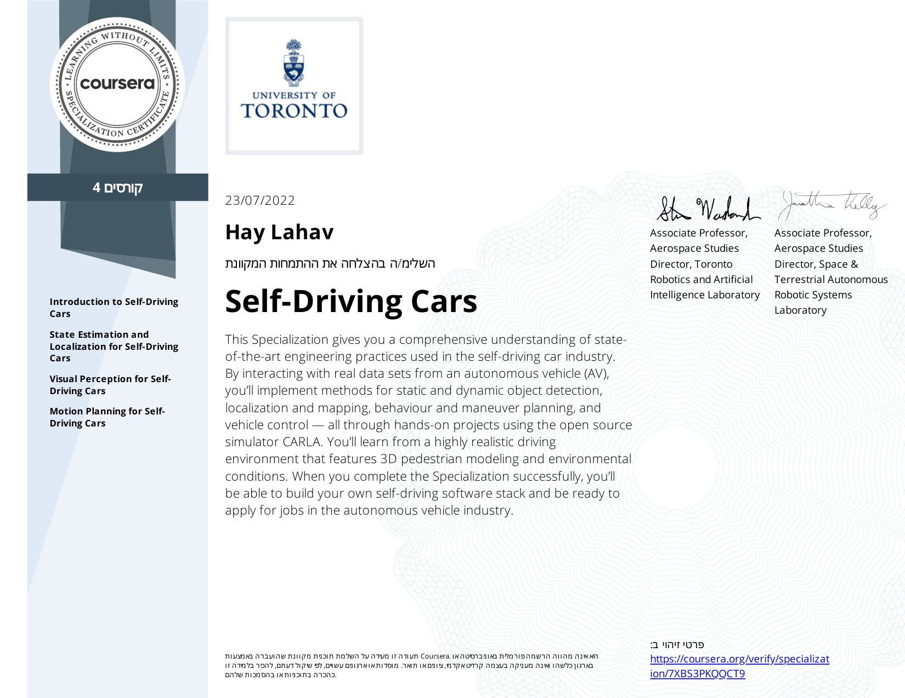
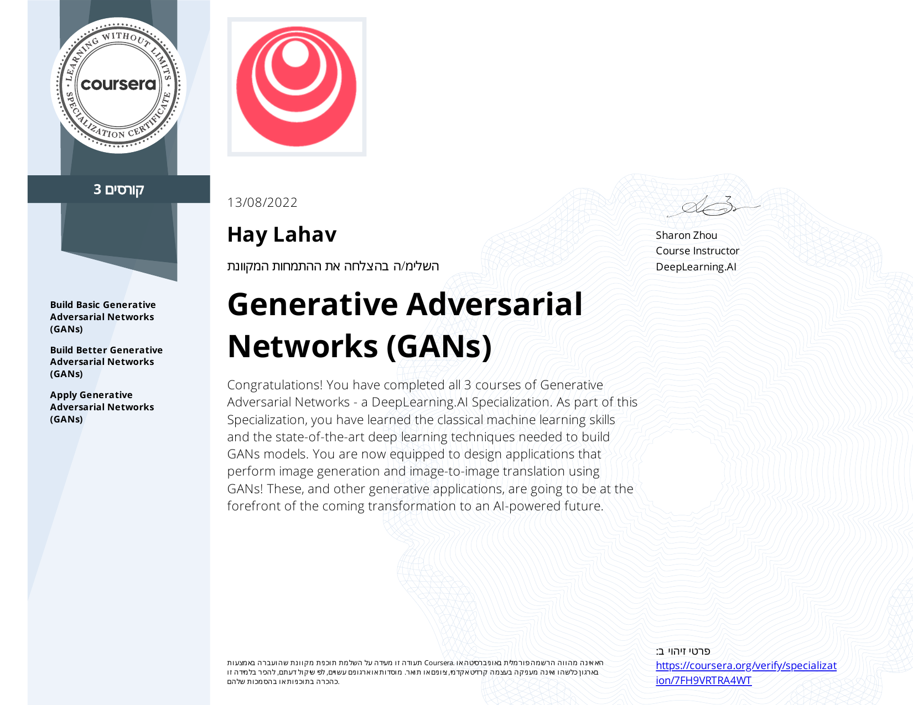
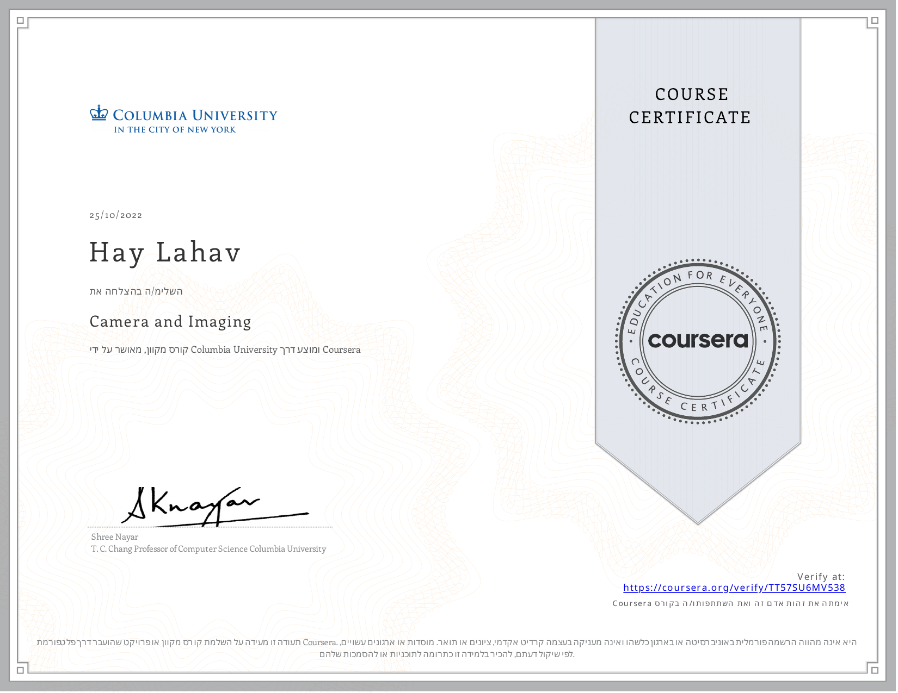
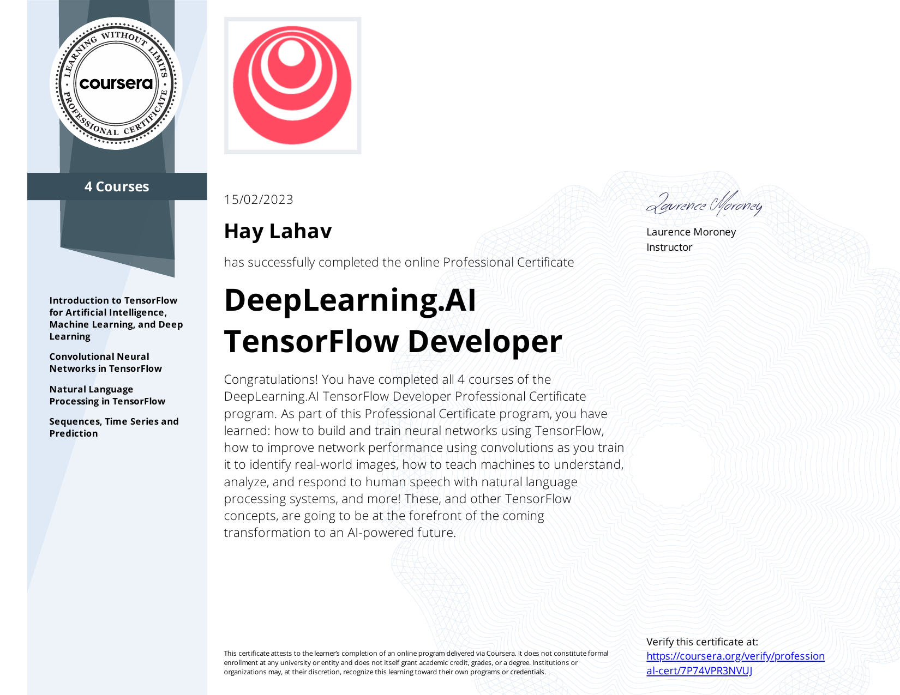
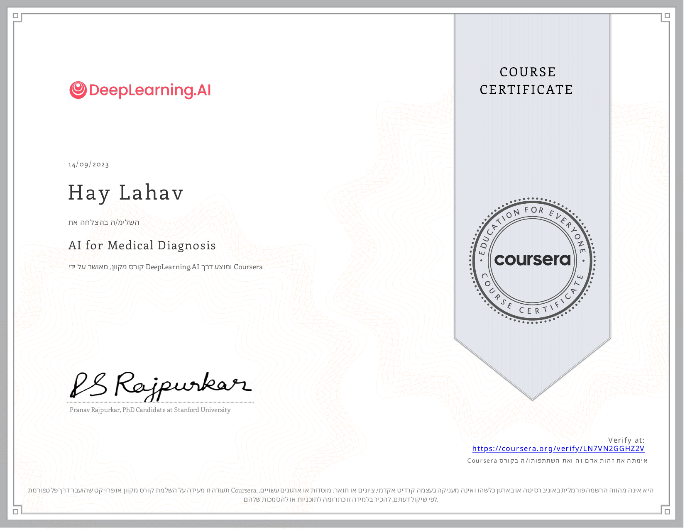
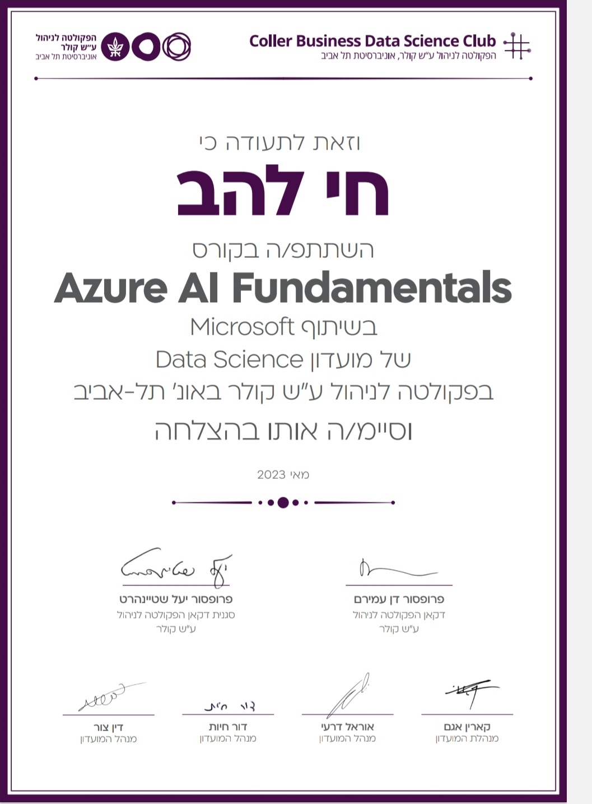

# 👋 Hi, I’m @HayLahav  
Welcome to my profile! Here's a short background about myself—check it out 👇🏻

---

🎓 I am a student in the School of Graduate Studies for a degree in Electrical and Electronics Engineering at **Tel Aviv University**.  
🎓 B.Sc. graduate in Electrical and Electronics Engineering at **Tel Aviv University**.

**📷 Final degree project:**  
*Electronic stabilization of images and videos by smartphone/laptop sensors and video processing algorithms.*

---

## 🌟 Interests

- **AI and Signal Algorithms**: Deep Learning, Computer Vision, Image and Video Processing  
  > Focused on camera and sensing technologies, especially in the fields of autonomous vehicles and healthcare solutions.

- **AI Hardware and Processors**  
  > Interested in the hardware domain, with a focus on camera systems and AI-oriented processors.

---

## 🧰 Tech Stack

<!-- Programming Languages -->

<!-- Deep Learning & AI -->

<!-- Tools & Platforms -->

---

## 📚 Academic Coursework

<table>
  <tr>
    <td valign="top" width="50%">

<b>Advanced Studies Courses (Tel Aviv University)</b>

| Course                                                             | Grade |
|--------------------------------------------------------------------|-------|
| Optimization                                                       | 89    |
| Deep Learning                                                      | 92    |
| Video Processing                                                   | 92    |
| Mathematical Methods in Data Science and Signal Processing         | 95    |
| Random Processes                                                   | 88    |
| Computational Learning Theory                                      | 80    |
| Advanced Topics in Learning Theory                                 | 95    |

**GPA:** 86

</td>
    <td valign="top" width="50%">

<b>Undergraduate Courses</b>

| Course                     | Grade |
|---------------------------|-------|
| Python                    | 86    |
| C Programming             | 88    |
| Computer Vision           | 87    |
| Image Processing Lab      | 96    |
| Digital Logic Systems     | 89    |
| Digital Circuits          | 82    |
| VLSI                      | 91    |

</td>
  </tr>
</table>

---

## 💻 Programming Skills

- **Languages**: C, Python, Matlab, C++ (intermediate), Verilog (intermediate)  
- **Python Libraries**: NumPy, SciPy, Matplotlib, Pandas, OpenCV  
- **Frameworks**: Keras, TensorFlow, PyTorch  
- **Tools**: Linux (Ubuntu), CUDA, Git, Docker, Xilinx Vivado, Cadence Virtuoso  

🛠 Verilog Projects:
- FPGA Countdown  
- FPGA I/O Interfaces

---

## 🧪 Volunteer Experience

**Computer Vision Engineer – Paragrutarally (Jan 2024 – Present)**  
- Developing AI-driven vision models using NVIDIA Jetson and depth cameras.

---

## 🎓 Certifications

- IBM AI Engineering Professional Certificate (v2)  
- Self-Driving Cars Specialization – University of Toronto (Coursera)  
- GANs Specialization – DeepLearning.AI  
- 50+ AI & Computer Vision Certifications on LinkedIn

---

## 🙋‍♂️ About Me

I’m a highly motivated and curious individual with strong self-learning abilities. I work well in a team and am eager to begin my career in the Artificial intelligence (AI) industry as a dedicated young professional developer and researcher.

---

## 📫 How to Reach Me

- 📧 Email: **haylahav1@gmail.com**  
- 🔗 LinkedIn: [linkedin.com/in/hay-lahav](https://linkedin.com/in/hay-lahav)  
- 🌐 Portfolio: [gamma.app/public/Hay-Lahav](https://gamma.app/public/Hay-Lahav-ubnnkqhihluld6j)  
- 🧠 GitHub: [@HayLahav](https://github.com/HayLahav)

---
## 🏅 Credly Certifications

  
  
  
  
  

📌 View all my verified credentials on my [Credly profile](https://www.credly.com/users/hay-lahav/badges).

📜 Additional Certifications

  
  
  
  
  
  
  
  
  

- **Fundamentals of Agents** (Unit 1: Foundations of Agents) — Hugging Face Agents Course
- **Fundamentals of Accelerated Computing with CUDA Python** — NVIDIA Deep Learning Institute ([Verify](https://learn.nvidia.com/certificates?id=702c193c02f547ab9659d41cd9ce4b1d))
- **Computer Vision Dataset Profiling Course** — Deci ([Certificate](https://drive.google.com/file/d/14H5UWHpeck5YsNa5Q3Yzz6eoUcS_AiXp/view?usp=sharing))
- **Azure AI Fundamentals** — Coller Business Data Science Club (TAU) × Microsoft
- **Introduction to Image Generation** — Google Cloud
- **Camera and Imaging** — Coursera / Columbia University ([Verify](https://coursera.org/verify/TT57SU6MV538))
- **3D Reconstruction - Multiple Viewpoints** — Coursera / Columbia University ([Verify](https://coursera.org/verify/XNCA7GFPEMF7))
- **DeepLearning.AI TensorFlow Developer** (Professional Certificate, 4 courses) — Coursera / DeepLearning.AI ([Verify](https://coursera.org/verify/professional-cert/7P74VPR3NVUJ))
- **AI for Medical Diagnosis** — Coursera / DeepLearning.AI ([Verify](https://coursera.org/verify/LN7VN2GGHZ2V))
- **Self-Driving Cars** (Specialization, 4 courses) — Coursera / University of Toronto ([Verify](https://coursera.org/verify/specialization/7XBS3PKQQCT9))
- **Generative Adversarial Networks (GANs)** (Specialization, 3 courses) — Coursera / DeepLearning.AI ([Verify](https://coursera.org/verify/specialization/7FH9VRTRA4WT))

